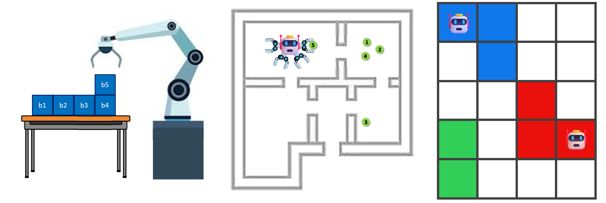
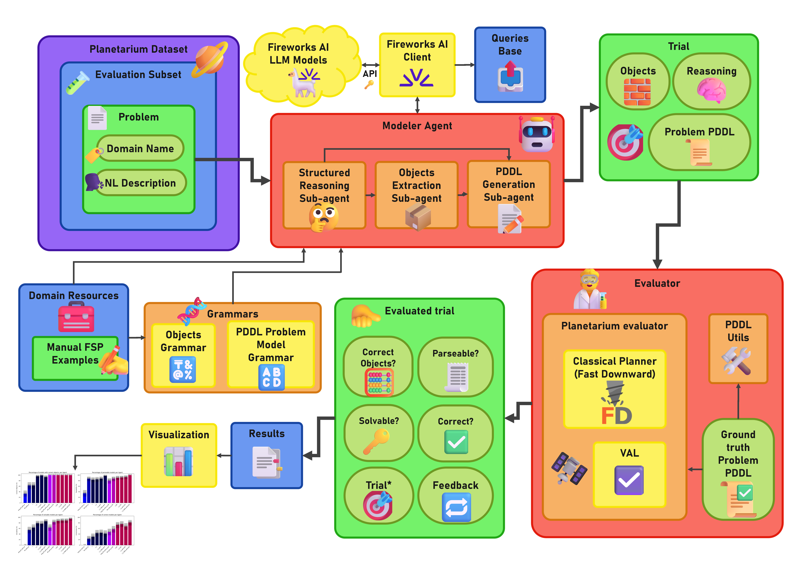
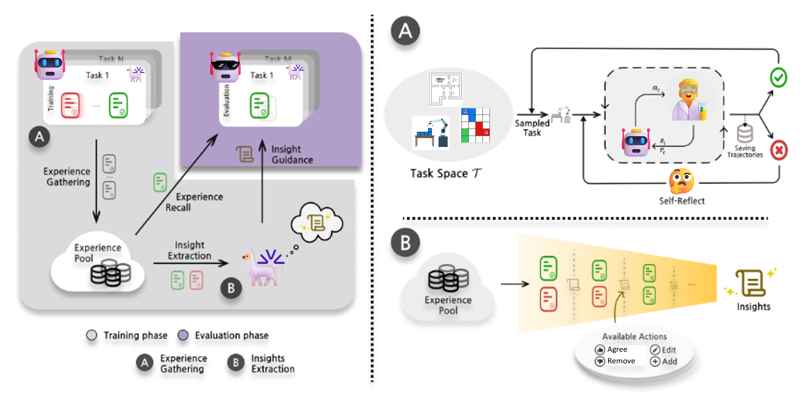
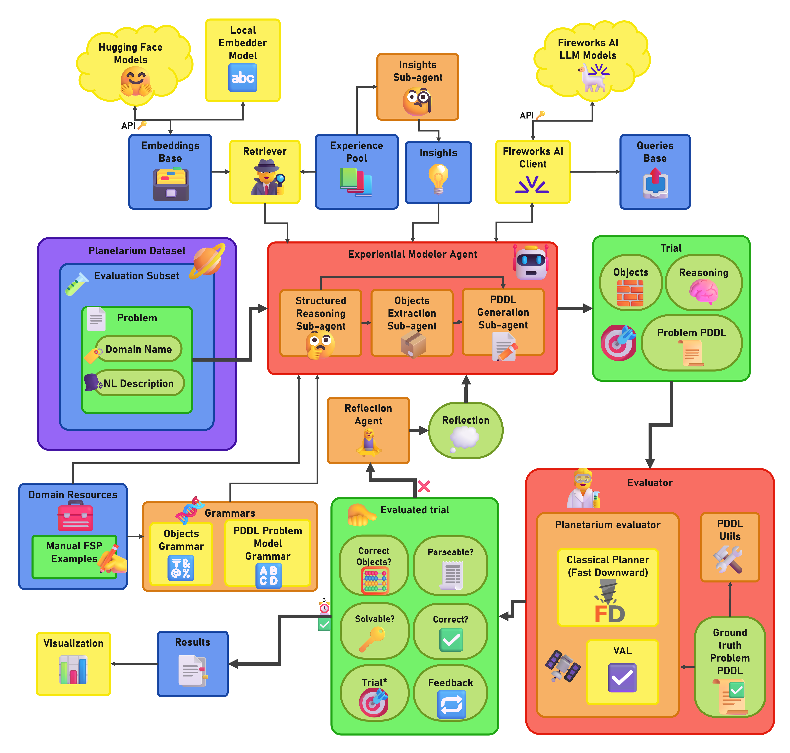
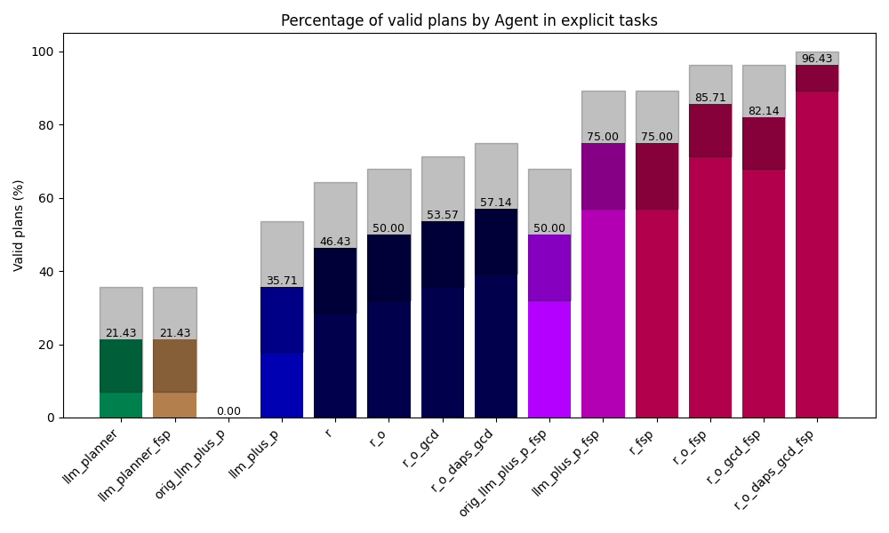
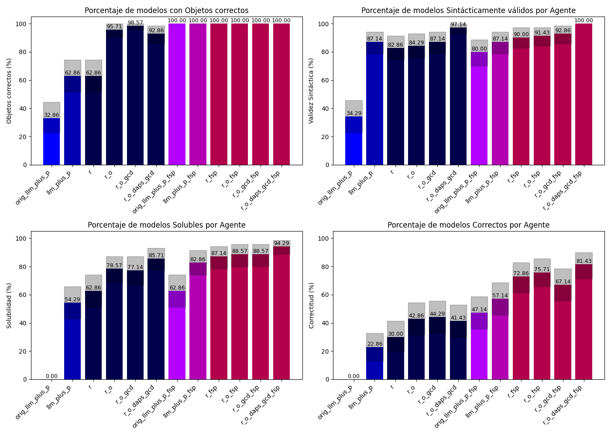

# PLAN-GRAIL 🧠🔧
**<u>P</u>lanning with <u>L</u>LM-based <u>A</u>gents via <u>N</u>euro-symbolic modeling with <u>G</u>rammar-Constrained decoding, <u>R</u>easoning, and <u>A</u>ctive <u>I</u>n-context <u>L</u>earning**

[]()
[]()
[]()

PLAN-GRAIL is a modular and extensible modeling agent based on the **LLM-as-Modeler** paradigm. Its main objective is to automatically generate syntactically valid, solvable, and semantically correct PDDL (Planning Domain Definition Language) problem files from natural language descriptions, enabling classical planners to solve real-world planning tasks with minimal human intervention.

This work builds upon and extends the results of prior efforts such as [LLM+P](https://arxiv.org/abs/2304.11477), identifying their key limitations in generalization, syntax validation, and semantic coherence. The proposed solution introduces a set of enhancements and new techniques to address these challenges, including:

- ✅ **Grammar-Constrained Decoding (GCD)** using both handcrafted and problem-specific grammars derived from BNF specifications of PDDL, ensuring syntactic validity.
- 🧱 **Structured Multi-phase Reasoning**, including explicit object extraction and intermediate representations.
- 🔁 **Reflection with Automatic Feedback**, using failures and minimal human intervention to refine outputs.
- 📚 **Experiential Learning**, inspired by the ExpeL approach under the LLM-as-Planner paradigm, where the agent accumulates experience, extracts symbolic insights, and evolves its reasoning through iterative training and refinement.
- 🎯 **Few-Shot Prompting + RAG**, leveraging semantic retrieval of previously successful examples and learned insights to improve semantic fidelity and generalization.

The agent operates in an **Open-Loop** setting: it assumes a deterministic environment and does not incorporate execution feedback during planning. All models are evaluated using the **Planetarium** benchmark, which enables automatic verification of syntax, solvability, and semantic correctness. Comparative experiments with LLM+P baselines and agent variants demonstrate the cumulative impact of each component and the effectiveness of PLAN-GRAIL’s guided modeling pipeline.

---

## 📝 Abstract

Symbolic modeling of planning tasks remains one of the main bottlenecks for the practical adoption of classical planners in real-world contexts. While the *LLM-as-Planner* paradigm has recently gained attention, it faces serious limitations in verifiability and optimality. As an alternative, this thesis adopts the *LLM-as-Modeler* approach, in which agents based on *Large Language Models (LLMs)* automatically generate *PDDL (Planning Domain Definition Language)* models of planning problems from their natural language descriptions. A modular and extensible modeling agent is proposed, designed to improve the parseability, solvability, and semantic correctness of the generated models. The architecture combines multiple complementary techniques: structured multi-phase reasoning, *Grammar-Constrained Decoding (GCD)*, automatic feedback and failure-driven reflection, experiential learning through solution and *insight* extraction and refinement, and *Few-Shot Prompting* enriched with *Retrieval-Augmented Generation (RAG)*.

Empirical evaluation was conducted on stratified subsets of the *Planetarium* benchmark, comparing relevant *LLM+P* baselines and several variants of the proposed agent. Results show significant improvements across all key metrics, including the complete elimination of syntactic errors via *GCD* with specialized grammars, and an increase of up to **24.3 %** in semantic correctness over the best reproduced *baseline*, closing **56.7 %** of its performance gap. The combined inclusion of structured reasoning, object extraction, and *GCD* enabled a performance of **100 %** parseability, **87.1 %** solvability, and **81.4 %** correctness. By incorporating mechanisms for reflection and automatic feedback, residual errors were corrected, raising solvability to **98.57 %** and correctness to **84.29 %**. Finally, the synergistic combination of retries with reflection, retrieval of prior examples, and manually constructed *insights* further increased these rates to **100 %** and **87.14 %**, respectively.

This work contributes a functional architecture, a reproducible evaluation framework, and empirical evidence that properly guided and trained *LLMs* can serve as effective modeling agents. The proposed approach opens new perspectives for the design of hybrid neuro-symbolic systems in automated planning, with reduced reliance on expert human intervention.

---

## 📌 Context

Many real-world problems — from robotics to logistics — can be expressed as planning tasks. While classical planners are powerful, their adoption is hindered by the burden of symbolic modeling.

Recent LLM-based approaches often skip modeling altogether, directly generating plans. However, this sacrifices verifiability, optimality, and generality. PLAN-GRAIL stands on the LLM-as-Modeler paradigm: generate **PDDL models** from natural language, and let symbolic planners do the planning.

The proposed framework is trained and evaluated over the [Planetarium Benchmark](https://arxiv.org/abs/2407.03321).


---

## 🚀 Research Contributions

- ✅ A modular **LLM-based modeling agent** guided by grammar, structured reasoning, and experiential learning.
- 🧠 Integration of **Grammar-Constrained Decoding (GCD)** with domain-specific grammars.
- 🔁 Experiential training inspired by [ExpeL](https://arxiv.org/abs/2308.10144v3), with feedback-driven reflection and insight extraction.
- 🔍 Use of **Retrieval-Augmented Generation (RAG)** and **Few-Shot Prompting (FSP)** for better contextualization and transfer.
- 🧪 A reproducible **evaluation framework** over stratified subsets of the [Planetarium Benchmark](https://arxiv.org/abs/2407.03321).

---

## 🧪 Proposal & Architecture

PLAN-GRAIL is composed of several complementary modules:

- **Structured Multi-Phase Modeling**: object extraction, goal analysis, PDDL assembly.
- **GCD with GBNF Grammars**: enforce syntactic validity at generation time.
- **Reflection & Feedback**: correct failures through guided retries and corrections.
- **Experiential Learning**: derive insights from both failed and successful generations.
- **RAG + FSP**: reuse relevant prior examples via embedding similarity.

### Evaluation Pipeline



### Experience-Driven Refinement



### Experiential Agent Evaluation



---

## Comparison with LLM-based direct-planning agents 



## 📊 Evaluation Results

We evaluated PLAN-GRAIL and its ablations across 70 planning tasks from the Planetarium benchmark, focusing on three metrics:

- ✅ **Syntactic Validity**
- 🔄 **Solvability**
- 🧠 **Semantic Correctness**



The integration of structured reasoning, object extraction, and *GCD* allowed for **100 %** parseability, with solvability and correctness initially measured at **87.1 %** and **81.4 %**, respectively. 

The incorporation of reflection mechanisms and automatic feedback led to a significant improvement in these metrics, raising solvability to **98.57 %** and correctness to **84.29 %**. Further performance gains were achieved through a combination of reflection-based retries, retrieval of analogous examples, and manually derived *insights*, culminating in **100 %** solvability and **87.14 %** correctness.

---

## 📁 Repository Structure

```bash
📦 Thesis
 ┣ 📂 docs/                       # LaTeX source files to generate the written thesis PDF
 ┣ 📂 src/                        # Project root (source code)
 ┃ ┣ 📂 agents/                   # Implementation of modeler and planner agents
 ┃ ┃ ┣ 📄 modeler_agents.py         # Modeler agents with proposed enhancements
 ┃ ┃ ┣ 📄 orig_llm_plus_p_agents.py # Original LLM+P baseline modeler agents
 ┃ ┃ ┣ 📄 planner_agents.py         # LLM-as-Planner agents used as baselines
 ┃ ┃ ┗ 📄 reflection_agent.py       # Error-reflecting agent module
 ┃ ┣ 📂 classical_planner/        # Wrapper for external classical planners
 ┃ ┃ ┗ 📄 planner.py                # Interface to Fast Downward
 ┃ ┣ 📂 client/                   # Interface to LLM APIs
 ┃ ┃ ┣ 📂 queries/                  # Logs of LLM queries (as JSON)
 ┃ ┃ ┣ 📄 client.py                # Fireworks AI client for LLM querying
 ┃ ┃ ┗ 📄 token_consumption.json   # Token usage logs per request
 ┃ ┣ 📂 dataset/                 # Dataset handling and documentation
 ┃ ┃ ┣ 📂 subsets/                 # Stratified evaluation/training subsets
 ┃ ┃ ┣ 📄 dataset.py              # Dataset loading and slicing logic
 ┃ ┃ ┣ 📄 dataset-v4.db           # SQLite database of Planetarium
 ┃ ┃ ┗ 📄 report.md               # Technical dataset report
 ┃ ┣ 📂 domains/                 # Planning domain resources
 ┃ ┃ ┣ 📂 blocksworld/             # Blocksworld domain resources
 ┃ ┃ ┃ ┣ 📄 domain.pddl             # PDDL domain file
 ┃ ┃ ┃ ┣ 📄 domain_description.txt  # Textual domain description
 ┃ ┃ ┃ ┣ 📄 actions_description.txt # Action descriptions
 ┃ ┃ ┃ ┣ 📄 fsp_ex_nl.txt           # Natural language description for FSP example
 ┃ ┃ ┃ ┣ 📄 fsp_ex_objects.json     # Typed objects from FSP example
 ┃ ┃ ┃ ┣ 📄 fsp_ex_pddl.pddl        # Generated PDDL file for FSP example
 ┃ ┃ ┃ ┣ 📄 fsp_ex_plan.pddl        # Classical plan for FSP example
 ┃ ┃ ┃ ┣ 📄 fsp_ex_reasoning.txt    # Structured reasoning steps
 ┃ ┃ ┃ ┗ 📄 planner_output_syntax.txt # Expected planner output format
 ┃ ┃ ┣ 📂 floor-tile/              # Analogous files for Floor-Tile
 ┃ ┃ ┣ 📂 gripper/                 # Analogous files for Gripper
 ┃ ┃ ┗ 📄 utils.py                 # Utilities for domain handling
 ┃ ┣ 📂 exp/                     # Experiential learning module
 ┃ ┃ ┣ 📂 exps/                    # Experience pool accumulated during training
 ┃ ┃ ┣ 📂 operations/              # Insight extraction operation logs
 ┃ ┃ ┣ 📄 experience_pool.py       # Management of experience pool
 ┃ ┃ ┣ 📄 insights.json            # Extracted and human-built insights
 ┃ ┃ ┣ 📄 insights_extraction.py   # Insight extraction logic
 ┃ ┃ ┣ 📄 insights_extraction_progress.json # Insight extraction progress tracking
 ┃ ┃ ┣ 📄 training.py              # Experiential agent training logic
 ┃ ┃ ┗ 📄 training_progress.json   # Training progress tracking
 ┃ ┣ 📂 grammar/                # GCD grammar construction
 ┃ ┃ ┣ 📄 grammar.py               # Grammar building methods
 ┃ ┃ ┣ 📄 kovacs-pddl-3.1-2011.pdf # Official PDDL 3.1 BNF specification
 ┃ ┃ ┗ 📄 pddl_bnf.py              # PDDL BNF grammar as code
 ┃ ┣ 📂 rag/                    # Retrieval-Augmented Generation module
 ┃ ┃ ┣ 📄 api_embedder.py          # Embeddings via HuggingFace API
 ┃ ┃ ┣ 📄 embeddings_with_ids_test5.npz  # Precomputed test embeddings
 ┃ ┃ ┣ 📄 embeddings_with_ids_train5.npz # Precomputed train embeddings
 ┃ ┃ ┣ 📄 local_embedder.py        # Local embedding via sentence-transformers
 ┃ ┃ ┗ 📄 retriever.py             # RAG retriever class
 ┃ ┣ 📂 results/                # Evaluation results
 ┃ ┣ 📂 utils/                  # Shared utility functions
 ┃ ┃ ┣ 📄 evaluation_utils.py      # Evaluation methods for generated models
 ┃ ┃ ┣ 📄 io_utils.py              # File I/O utilities
 ┃ ┃ ┣ 📄 pddl_utils.py            # PDDL file handling functions
 ┃ ┃ ┣ 📄 planning_utils.py        # Classical planner integration helpers
 ┃ ┃ ┣ 📄 result_utils.py          # Results formatting and processing
 ┃ ┃ ┗ 📄 tokens_utils.py          # Token usage analysis
 ┃ ┣ 📂 validator/              # Plan validator module
 ┃ ┃ ┗ 📄 validator.py             # Integration with VAL
 ┃ ┣ 📂 visualizer/            # Results visualization
 ┃ ┃ ┗ 📄 visualizer.py            # Plotting and metrics diagrams
 ┃ ┣ 📄 check_planetarium_generation.py # Dataset validation script
 ┃ ┣ 📄 config.py                 # Global config and hyperparameters
 ┃ ┣ 📄 evaluations_progress.json        # Logs for basic agent evaluations
 ┃ ┣ 📄 exp_evaluation_progress.json     # Logs for experiential agent evaluations
 ┃ ┗ 📄 main.py                  # Project entry point
```

---

## 📚 Citation

If you use PLAN-GRAIL in your research, please cite it as follows:

```bibtex
@thesis{gonzalez2025plangrail,
  title     = {PLAN-GRAIL: Planning with LLM-based Agents via Neuro-symbolic modeling with Grammar-Constrained Decoding, Reasoning and Active In-Context Learning},
  author    = {Ariel González Gómez},
  year      = {2025},
  type      = {Bachelor's Thesis},
  school    = {Universidad de La Habana},
  url       = {https://github.com/arielgg46/Thesis},
  note      = {Available at: \url{https://github.com/arielgg46/Thesis}}
}
```
